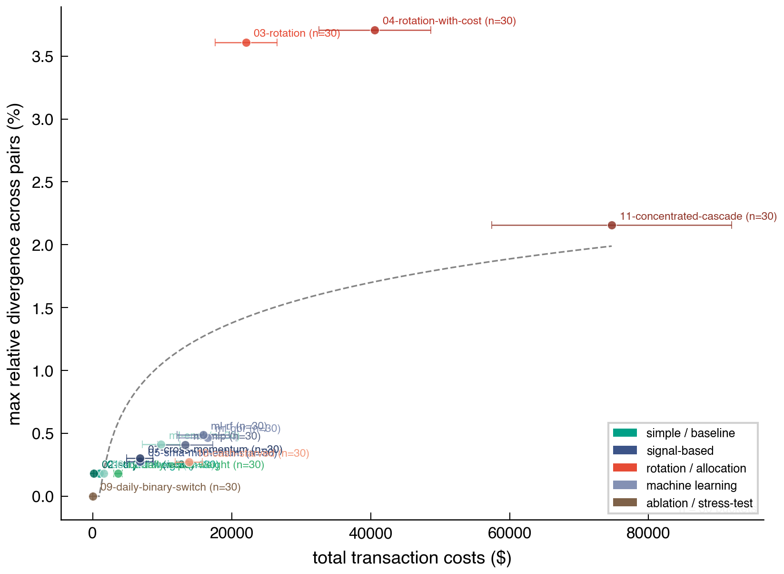
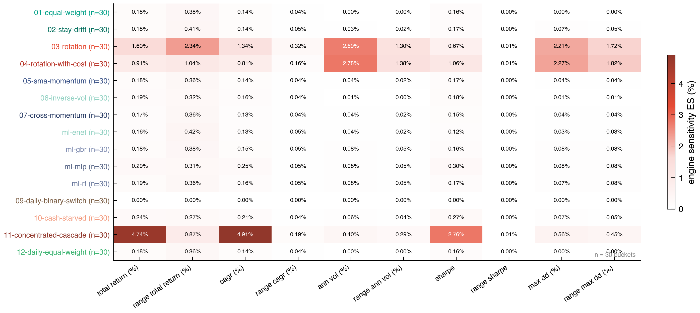

# summary

`crossengine` is a Python package that provides (1) a multi-asset portfolio backtesting engine and (2) a cross-engine concordance testing API. the engine implements the proportional-cost specification from Algorithm 1 of the companion paper [@yin2026implementation]. the concordance API runs the same strategy through multiple independent backtesting engines (bt [@pmorissette2024bt], vectorbt [@vbt2024], Backtrader [@backtrader2024], and cvxportfolio [@boyd2017cvxportfolio]) and quantifies how much they disagree.

we built this tool because we found, during the research for our companion paper, that practitioners implicitly trust their backtesting engine as ground truth. yet when we fed identical strategies, identical data, and identical cost parameters to five different engines, the results diverged, sometimes by over 3% in cumulative equity. this is not a bug in any single engine; it is a structural property of how each engine implements execution order, commission timing, and cash settlement. we call this "implementation risk," and we believe it represents a previously unquantified source of error in portfolio evaluation.

# statement of need

no existing tool allows a practitioner to validate backtesting results across engines. each engine operates as an isolated system with its own conventions, and a strategy that produces a 14.5% CAGR in one engine may show 14.2% in another. the user has no way to detect this without manually reimplementing their strategy in every engine, a process that in our experience takes days per engine and is itself error-prone.

the divergence is silent: every engine returns a confident equity curve and a precise Sharpe ratio, and nothing in the output signals that another engine would disagree. during our forensic analysis, we found that a single undocumented default setting in vectorbt (`call_seq` order) caused a 31% equity divergence, and that Backtrader's default commission handling silently undercharges by 100x due to an unintuitive `percabs` parameter. these are the defaults that most users encounter, not exceptional configurations.

`crossengine` fills this gap with a single function call:

```python
from crossengine.concordance import concordance

report = concordance(my_strategy, prices)
print(report.summary())
```

the concordance API accepts either a strategy function or a pre-computed weight schedule, runs it through all installed engines, and returns a `ConcordanceReport` with pairwise divergence metrics, equity curves, and engine sensitivity measures.

the companion paper validates this tool on 12 benchmark strategies (plus 4 ML approaches) across 30 non-overlapping asset buckets (180 S&P 500 stocks). validation tests compare all 150 equity curves (5 engines x 30 buckets) against the paper's saved results with sub-penny tolerance ($0.01).



# features

- **backtesting engine**: multi-asset portfolio simulation with proportional commission and slippage models, STAY semantics (freeze share count, let weight drift), and limit/stop order support
- **concordance testing**: run the same strategy through 5 engines with a single function call
- **STAY signal**: a first-class "hold and drift" instruction in the signal schedule. we found this necessary because partial rebalancing (hold some assets, trade others) is common in practice but inexpressible in a pure target-weight format. engines with runtime portfolio state (ours, bt, Backtrader) resolve STAY natively; engines that receive signals upfront (vectorbt, cvxportfolio) receive pre-resolved drifted weights via forward simulation
- **graceful engine detection**: the concordance API runs whichever engines are installed and skips missing ones. this matters because vectorbt and Backtrader have heavy or unmaintained dependency trees that not every user will want to install
- **ConcordanceReport**: pairwise divergence metrics, max divergence, engine sensitivity, equity curves as a DataFrame, JSON export, and publication-ready plots

# design



the package uses a two-layer architecture that we arrived at after considerable iteration. the backtesting engine accepts a signals DataFrame (with optional STAY sentinels) and produces a `BacktestResult` with portfolio value, positions, trades, and metrics. the concordance layer uses a `SignalSchedule` dict as its interchange format (`{Timestamp: {asset: weight | STAY}}`), which each engine wrapper translates into its native API.

the category A/B split for STAY resolution is the decision that most shaped the architecture. engines with access to live portfolio state (ours, bt, Backtrader) can compute drifted weights at runtime, and this computation is exact. engines that receive their full signal schedule upfront (vectorbt, cvxportfolio) cannot query portfolio state during simulation, so we pre-resolve STAY into concrete drifted weights via a forward simulation. this introduces a small approximation (the forward simulation uses simplified cost accounting), which we consider acceptable: the approximation error is well below the cross-engine divergence that the tool is designed to measure.

# limitations

this tool measures divergence, not correctness. when five engines disagree, the concordance API quantifies the disagreement but does not determine which engine is right. our engine is one of the five data points, not an arbiter.

the current signal format is limited to target weights. strategies that express signals as dollar amounts, share counts, or rankings must convert to weights before using the concordance API. we chose weights as the interchange format because it is the largest common subset of what all five engines can consume.

the forward simulation for category B STAY resolution does not perfectly replicate each engine's internal cost accounting. for the benchmarks in the companion paper, this produces at most 0.045% additional divergence on STAY-heavy strategies, small relative to the cross-engine divergence being measured, but not zero.

# testing

the package includes 44 tests that cover the engine, STAY resolution, wrapper correctness, orchestrator routing, and full-pipeline validation. the full validation test runs BM01 (equal-weight monthly rebalance) through all 5 engines on all 30 stratified asset buckets and compares each equity curve against the paper's saved results. all 150 comparisons match to sub-penny tolerance.

# acknowledgements

this work was conducted at the University of Cambridge. we thank the developers of bt, vectorbt, Backtrader, and cvxportfolio for making their engines open source. the forensic case studies in the companion paper would not have been possible without access to these codebases.

# references
